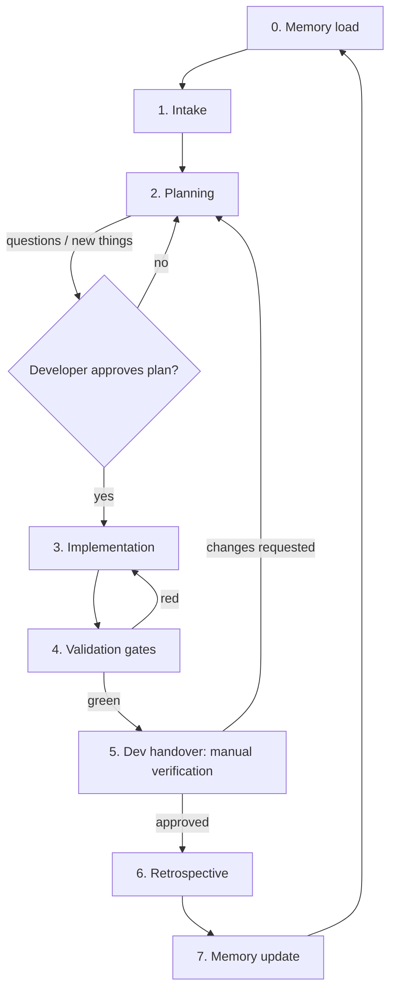

# Agentic development workflow

How this team uses Copilot / AI agents across the delivery lifecycle. Rules for agents live in
[AGENTS.md](../../AGENTS.md); this document describes the *process* and who is responsible for what.

## The loop



Two custom agents implement the two halves:

| Stage | Agent | Tools |
| ----- | ----- | ----- |
| Memory → Intake → Planning | [plan-user-story](../../.github/agents/plan-user-story.agent.md) | read-only |
| Implementation → Validation → Handover → Retrospective | [deliver-user-story](../../.github/agents/deliver-user-story.agent.md) | read/write/execute |

Splitting them is deliberate: the planning agent cannot accidentally modify the repository, and the
delivery agent starts from an approved plan instead of its own interpretation of the story.

---

## 0. Memory load

**Agent.** Read `docs/ai/memory.md`, `patterns.md`, `decisions.md`, `testing.md` and any retrospective
relevant to the area being touched. State in one short paragraph which memory entries apply to this
task. If memory contradicts the code, say so — that is a finding, not a detail.

Exit criteria: the agent has quoted the memory entries it will rely on.

## 1. Intake

**Agent.** Fetch the user story from the backlog source of truth:

- CSV export at `docs/ai/user-stories.csv` (default; column contract in [README.md](README.md)), or
- a story pasted into chat, or
- Microsoft Planner via MCP once enabled — read-only (see [mcp-planner.md](mcp-planner.md)).

Restate: story ID, title, user-facing goal, acceptance criteria, priority, dependencies. If the story
cannot be found or its acceptance criteria are empty, stop and ask.

Exit criteria: story restated and confirmed by the developer as the right one.

## 2. Planning

**Agent + developer, conversational.** The agent inspects the affected code, then produces a plan
containing story reference, restated acceptance criteria, files per layer, Prisma impact, test plan,
validation gates, assumptions, open questions, items needing approval, and risk/rollback notes.

**Rules**

- Ask about anything ambiguous. Batch the questions.
- Everything new to the project — dependency, layer, pattern, table, column, endpoint shape, config —
  goes in a **Needs approval** list, and work stops there until a developer answers.
- No code is written in this stage.

Exit criteria: developer replies "approved" (or answers the questions and then approves). The approved
plan is pasted into the story/PR description so it survives the chat session.

## 3. Implementation

**Agent.** Work the plan in layer order: `Dto` → `mappers` → `services` → `controllers` → `routes`,
tests alongside. Follow the conventions in AGENTS.md §5.

- Stay inside the approved scope. New findings go back to Planning; they do not get "just fixed".
- No drive-by refactors, renames, formatting sweeps, or dependency bumps.
- Commit locally in small steps. Never push.

Exit criteria: the plan's file list is complete and the code compiles.

## 4. Validation

**Agent.** Run the gates and report the actual output. See AGENTS.md §6 for the table.

```bash
npm run ci:check                     # lint + format (as CI runs it)
npx tsc --noEmit -p tsconfig.json    # typecheck
npm test                             # unit + route/integration (needs Docker for Testcontainers)
npm run build                        # compile
```

Plus, when relevant: `npx prisma migrate deploy` against a fresh database for schema changes, and a
manual smoke run (`npm run dev` + the Postman collection in `postman/`) for new or changed endpoints.
This repo has no E2E suite; record it as **N/A** in the handover rather than silently skipping it.

**Rules**

- Never weaken a gate: no deleted or skipped tests, no `any` to silence the compiler, no `--no-verify`.
- A gate that fails for an environmental reason (e.g. Docker not running) is reported as
  **not run**, not as passed.

Exit criteria: every applicable gate green, or an explicit, honest list of what is red and why.

## 5. Dev handover — manual verification

**Agent produces, developer decides.** The agent posts a handover note:

```markdown
## Handover — <STORY-ID> <title>

**Scope** — what changed, in one paragraph.
**Files** — grouped by layer.
**API** — endpoints added/changed, with request/response examples and status codes.
**Data** — migration name and effect, or "none".
**Gates** — lint / typecheck / unit / integration / build / migration / E2E: pass | fail | N/A (+ output).
**Manual verification steps** — exact commands and requests for the developer to run.
**Assumptions and deviations** — anything decided along the way.
**Risks and follow-ups** — known gaps, suggested next stories.
```

The developer verifies manually and answers:

- **Approve** → continue to Retrospective.
- **Decline / changes requested** → the reasons become inputs to a new **Planning** round, and the loop
  runs again from stage 2. Declines are not patched ad hoc in the chat.

Only a human moves the work item forward (PR, review request, `Ready for QA`, `Done`, `Released`).

Exit criteria: an explicit human approve or decline.

## 6. Retrospective

**Agent proposes, developer approves.** After approval the agent drafts
`docs/ai/retrospectives/YYYY-MM-DD-<story-id>-<slug>.md` from
[TEMPLATE.md](retrospectives/TEMPLATE.md): what was built, what went well, what went wrong, root
causes, and **candidate lessons**, each tagged with its destination memory file.

The developer reviews and marks each candidate lesson accepted or rejected. Rejected lessons are
dropped, not archived.

Exit criteria: retrospective file written, each lesson accepted or rejected.

## 7. Memory update

**Agent proposes, developer approves, then it is committed.** Accepted lessons are promoted:

| Lesson type | Destination |
| ----------- | ----------- |
| Project fact, environment gotcha, current state | [memory.md](memory.md) |
| Reusable code pattern or anti-pattern | [patterns.md](patterns.md) |
| A choice with alternatives and consequences | [decisions.md](decisions.md) |
| Test technique, flake, container quirk | [testing.md](testing.md) |
| Rule that should govern *every* task | [AGENTS.md](../../AGENTS.md) and/or [copilot-instructions.md](../../.github/copilot-instructions.md) |

**Promotion rules**

- Show the exact diff before writing; never edit memory silently.
- Keep entries one or two lines, dated, and linked to the retrospective or PR.
- Promote to AGENTS.md / copilot-instructions.md only when the lesson would change behaviour on most
  future tasks — otherwise it belongs in `docs/ai/`.
- Correct or delete entries that turn out to be wrong instead of adding a contradicting one.
- Memory changes are reviewed in the PR like code.

Exit criteria: memory diff approved and committed with the story.

---

## Roles

| | Agent | Developer |
| - | ----- | --------- |
| Load memory, fetch story, draft plan | ✔ | reviews |
| Approve assumptions and new things | | ✔ |
| Write code and tests | ✔ | reviews |
| Run validation gates | ✔ | spot-checks |
| Manual verification | | ✔ |
| Status transitions, push, PR, merge, release | | ✔ |
| Draft retrospective and memory diff | ✔ | approves |

## Anti-patterns

- Implementing straight from a story without a plan.
- "It mostly passes" handovers.
- Silent memory edits, or memory that grows into a changelog.
- Fixing decline feedback in-chat without going back through Planning.
- Agents moving work items to `Done` because the tests are green.
